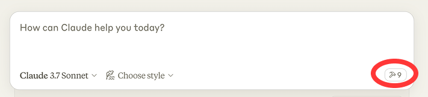

<div align="center">

# MCP for Blender

**Connect Blender to any LLM**

**Disclaimer:** This is a third-party integration and not made by Blender

Prompt-assisted 3D modeling, scene creation, and manipulation — driven by AI.

[](https://pepy.tech/projects/blender-mcp)
[](https://pypi.org/project/blender-mcp/)
[](LICENSE)
[](https://discord.gg/SNqPn4TcKQ)

[**Website**](https://mcp-for-blender.com/) · [**Full Tutorial**](https://www.youtube.com/watch?v=lCyQ717DuzQ) · [**Discord**](https://discord.gg/SNqPn4TcKQ) · [**Sponsor**](https://github.com/sponsors/ahujasid) · [**Buy me a coffee**](https://buymeacoffee.com/ahujasid) · [**Feedback**](https://cal.com/siddharth-ahuja/feedback-call)

<a href="https://trendshift.io/repositories/14834?utm_source=repository-badge&amp;utm_medium=badge&amp;utm_campaign=badge-repository-14834" target="_blank" rel="noopener noreferrer"></a>

<br />

**Supporters**

[CodeRabbit](https://www.coderabbit.ai/)
[Kevin Guanche Darias](https://github.com/KevinGuancheDarias)

**All supporters:** [Support this project](https://github.com/sponsors/ahujasid)

</div>

---

## Quickstart

Three steps: install `uv`, point your MCP client at the server, install the Blender addon.

**1. Install uv**

```bash
# macOS
brew install uv

# Linux
curl -LsSf https://astral.sh/uv/install.sh | sh

# Windows
powershell -c "irm https://astral.sh/uv/install.ps1 | iex"
```

> **Warning:** Do not proceed before installing uv. Use the official installer — *not* `pip install uv`.

**2. Add the MCP server to your client**

<details open>
<summary><b>Claude Desktop</b> — Settings → Developer → Edit Config</summary>

```json
{
    "mcpServers": {
        "blender": {
            "command": "uvx",
            "args": ["blender-mcp"]
        }
    }
}
```
</details>

<details>
<summary><b>Claude Code</b></summary>

```bash
claude mcp add blender uvx blender-mcp
```
</details>

<details>
<summary><b>Codex</b></summary>

```bash
codex mcp add blender -- uvx blender-mcp
```
</details>

<details>
<summary><b>Cursor / VS Code / OpenCode / Antigravity</b></summary>

See [MCP Client Setup](#mcp-client-setup) below for per-client instructions and one-click install buttons.
</details>

**3. Install the Blender addon**

```bash
uvx blender-mcp install-addon
```

Then in Blender: **Edit → Preferences → Add-ons** → enable **Interface: MCP for Blender**.

**4. Connect**

In Blender's 3D viewport, press `N` → open the **MCP for Blender** tab → click **Start MCP Server**. That's it — ask Claude to build something.

> **Note:** Only run **one** instance of the MCP server (either Cursor or Claude Desktop), not both.

---

## Table of Contents

- [Quickstart](#quickstart)
- [Features](#features)
- [Components](#components)
- [Installation](#installation)
  - [Prerequisites](#prerequisites)
  - [Make your client find uvx](#make-your-client-find-uvx)
  - [Pin the Python version](#pin-the-python-version)
  - [Install without uv](#install-without-uv)
  - [Run with Docker](#run-with-docker)
  - [Environment Variables](#environment-variables)
- [MCP Client Setup](#mcp-client-setup)
  - [Claude for Desktop](#claude-for-desktop)
  - [Codex](#codex)
  - [Cursor](#cursor)
  - [Visual Studio Code](#visual-studio-code)
  - [OpenCode](#opencode)
  - [Antigravity](#antigravity)
- [Installing the Blender Addon](#installing-the-blender-addon)
- [Upgrading (existing users)](#upgrading-existing-users)
- [Usage](#usage)
  - [Starting the Connection](#starting-the-connection)
  - [Using with Claude](#using-with-claude)
  - [Capabilities](#capabilities)
  - [Example Commands](#example-commands)
- [Persistent API Credentials](#persistent-api-credentials)
- [Troubleshooting](#troubleshooting)
- [Technical Details](#technical-details)
- [Limitations & Security Considerations](#limitations--security-considerations)
- [Telemetry Control](#telemetry-control)
- [Feedback](#feedback)
- [Contributing](#contributing)
- [Disclaimer](#disclaimer)
- [Star History](#star-history)

---

## Features

| | |
|---|---|
| **Two-way communication** | Connect Claude AI to Blender through a socket-based server |
| **Object manipulation** | Create, modify, and delete 3D objects in Blender |
| **Material control** | Apply and modify materials and colors |
| **Scene inspection** | Get detailed information about the current Blender scene |
| **Code execution** | Run arbitrary Python code in Blender from Claude |
| **Asset & model generation** | Poly Haven assets, Sketchfab models, Poly Pizza low-poly models, and AI-generated 3D models via Hyper3D Rodin and Hunyuan3D |

## Components

The system consists of two main components:

1. **Blender Addon** (`addon.py`) — a Blender addon that creates a socket server within Blender to receive and execute commands
2. **MCP Server** (`src/blender_mcp/server.py`) — a Python server that implements the Model Context Protocol and connects to the Blender addon

---

## Installation

### Prerequisites

- **Blender** 3.0 or newer
- **Python** 3.10 or newer
- **uv** package manager

<details>
<summary><b>Installing uv, per platform</b></summary>

**macOS**
```bash
brew install uv
```

**Windows**
```powershell
powershell -c "irm https://astral.sh/uv/install.ps1 | iex"
```

Then add uv to the user path in Windows (you may need to restart Claude Desktop after):

```powershell
$localBin = "$env:USERPROFILE\.local\bin"
$userPath = [Environment]::GetEnvironmentVariable("Path", "User")
[Environment]::SetEnvironmentVariable("Path", "$userPath;$localBin", "User")
```

**Linux**
```bash
curl -LsSf https://astral.sh/uv/install.sh | sh
```

It lands in `~/.local/bin` — open a new shell so it's on your PATH.

Otherwise, installation instructions are on their website: [Install uv](https://docs.astral.sh/uv/getting-started/installation/)

On every OS, use uv's **official installer above — not `pip install uv`**, which may not create the `uvx` command and can hide uv inside an environment your client can't see.
</details>

> **Warning:** Do not proceed before installing uv.

### Make your client find uvx

MCP clients started from a GUI (Claude Desktop, Cursor, VS Code from the Dock/Start menu) do **not** inherit your terminal's PATH, so a bare `"command": "uvx"` can fail with **`spawn uvx ENOENT`** even though `uvx` works in your terminal. If that happens:

- Find uvx's full path — `which uvx` (macOS/Linux) or `where uvx` (Windows) — and use it as `"command"`, e.g. `/opt/homebrew/bin/uvx` or `C:\Users\<you>\.local\bin\uvx.exe`.
- On Windows you can instead wrap it: `"command": "cmd", "args": ["/c", "uvx", "blender-mcp"]`.
- After any PATH or config change, **fully quit and relaunch** the client (Windows: quit from the system tray, not just the window; macOS: <kbd>Cmd</kbd>+<kbd>Q</kbd>).

### Pin the Python version

*Avoid conda / pyenv / version conflicts.*

uv chooses which Python runs the server. On machines with conda (auto-activated base), pyenv, or asdf — or with a newer CPython release that some dependencies do not have wheels for yet — uv can grab an interpreter that makes installation fail. Pin Python 3.11 and prefer uv-managed interpreters to avoid using whatever is on your PATH:

```json
{
    "mcpServers": {
        "blender": {
            "command": "uvx",
            "args": ["--python", "3.11", "blender-mcp"],
            "env": { "UV_PYTHON_PREFERENCE": "only-managed" }
        }
    }
}
```

`--python 3.11` still satisfies this package's `requires-python >=3.10`, and `UV_PYTHON_PREFERENCE=only-managed` keeps uv from selecting conda, pyenv, asdf, or system Python first. (The repo's `.python-version` is only a hint for contributors and does **not** affect `uvx`.)

If a previous failed attempt keeps replaying after a fix, clear the cache:

```bash
uv cache clean blender-mcp && uvx --refresh blender-mcp
```

### Install without uv

On locked-down machines you can skip uvx entirely with [`pipx`](https://pipx.pypa.io), then point your client at the installed command:

```bash
pipx install blender-mcp
pipx ensurepath          # then restart your shell / client
```

Use the resulting absolute path as `"command"` (find it with `which blender-mcp` / `where blender-mcp`) and omit `args`.

### Run with Docker

You can run the MCP server in a container instead of installing it. Blender itself still runs on your machine — the container only hosts the MCP server, which connects out to the Blender addon.

Build the image from the repo root:

```bash
docker build -t blender-mcp .
```

Then point your MCP client at it (the `-i` flag is required — the server talks to the client over stdin/stdout):

```json
{
    "mcpServers": {
        "blender": {
            "command": "docker",
            "args": ["run", "-i", "--rm", "blender-mcp"]
        }
    }
}
```

The image defaults to `BLENDER_HOST=host.docker.internal`, which reaches the host's Blender out of the box with Docker Desktop on **macOS and Windows**.

On **Linux**, `host.docker.internal` doesn't exist and the addon only listens on `localhost`, so use host networking instead:

```json
{
    "mcpServers": {
        "blender": {
            "command": "docker",
            "args": ["run", "-i", "--rm", "--network=host", "-e", "BLENDER_HOST=localhost", "blender-mcp"]
        }
    }
}
```

To enable [safe mode](#safe-mode) in the container, add `"-e", "BLENDER_MCP_SAFE_MODE=1"` to `args`.

### Environment Variables

The following environment variables can be used to configure the Blender connection:

| Variable | Default | Description |
|---|---|---|
| `BLENDER_HOST` | `localhost` | Host address for Blender socket server |
| `BLENDER_PORT` | `9876` | Port number for Blender socket server |
| `BLENDER_MCP_SAFE_MODE` | off | Set to `1` to validate scripts before they run in Blender (see below) |

Example:

```bash
export BLENDER_HOST='host.docker.internal'
export BLENDER_PORT=9876
```

You can also pass the connection as CLI flags, which take precedence over the
environment variables. This is handy for running several Blender instances side
by side, since each MCP client entry can point at a different port with plain
arguments instead of env vars:

```bash
uvx blender-mcp --port 9877
```

In an MCP client config that means a second entry differing only in `args`:

```json
{
  "mcpServers": {
    "blender": { "command": "uvx", "args": ["blender-mcp"] },
    "blender-b": { "command": "uvx", "args": ["blender-mcp", "--port", "9877"] }
  }
}
```

Each instance needs its own port set in the Blender addon panel to match.

> **Note:** the addon's socket server has no authentication or encryption, so
> anyone who can reach that port can run Python inside Blender. Keep it on
> `localhost` unless you are on a trusted network, and prefer an SSH tunnel over
> pointing `--host`/`BLENDER_HOST` at a remote machine directly.

#### Safe mode

By default, the AI can run any Python code in Blender. Set `BLENDER_MCP_SAFE_MODE=1` to check every script before it runs and block risky code — things like reading or writing files directly, running other programs, accessing the network, or installing code that keeps running after the script ends. Normal Blender work (modeling, materials, rendering, saving, import/export) still works. Blocked scripts are sent back to the AI with the reason, so it can try again with a corrected version.

---

## MCP Client Setup

### Claude for Desktop

[Watch the setup instruction video](https://www.youtube.com/watch?v=neoK_WMq92g) (assuming you have already installed uv)

Go to **Claude → Settings → Developer → Edit Config → `claude_desktop_config.json`** and include the following:

```json
{
    "mcpServers": {
        "blender": {
            "command": "uvx",
            "args": [
                "blender-mcp"
            ]
        }
    }
}
```

<details>
<summary><b>Claude Code</b></summary>

Use the Claude Code CLI to add the MCP for Blender server:

```bash
claude mcp add blender uvx blender-mcp
```
</details>

### Codex

The Codex CLI, desktop app, and IDE extension all share the same config file (`~/.codex/config.toml`), so setting the server up once covers all three.

Register the server with the [Codex CLI](https://github.com/openai/codex):

```bash
codex mcp add blender -- uvx blender-mcp
```

Or add it by hand to `~/.codex/config.toml` (or `$CODEX_HOME/config.toml`):

```toml
[mcp_servers.blender]
command = "uvx"
args = ["blender-mcp"]
```

Or in the **Codex desktop app**: **Settings → MCP servers → Add server** → name it `blender`, pick **STDIO**, enter `uvx blender-mcp` as the command, then **Save** and restart. If the app can't find `uvx`, use its full path instead — see [Make your client find uvx](#make-your-client-find-uvx).

Check it registered with `codex mcp list` — the `blender` server should show as **enabled**. The tools become available the next time you start Codex.

To set [environment variables](#environment-variables) (e.g. a non-default Blender host/port), pass `--env KEY=VALUE` flags to `codex mcp add`, or add them in the config file:

```toml
[mcp_servers.blender]
command = "uvx"
args = ["blender-mcp"]
env = { BLENDER_HOST = "localhost", BLENDER_PORT = "9876" }
```

### Cursor

[](https://cursor.com/link/mcp%2Finstall?name=blender&config=eyJjb21tYW5kIjoidXZ4IGJsZW5kZXItbWNwIn0%3D)

**macOS** — go to **Settings → MCP** and paste the following:

- To use as a global server, use the *"add new global MCP server"* button and paste
- To use as a project-specific server, create `.cursor/mcp.json` in the root of the project and paste

```json
{
    "mcpServers": {
        "blender": {
            "command": "uvx",
            "args": [
                "blender-mcp"
            ]
        }
    }
}
```

**Windows** — go to **Settings → MCP → Add Server**, add a new server with the following settings:

```json
{
    "mcpServers": {
        "blender": {
            "command": "cmd",
            "args": [
                "/c",
                "uvx",
                "blender-mcp"
            ]
        }
    }
}
```

[Cursor setup video](https://www.youtube.com/watch?v=wgWsJshecac)

> **Note:** Only run **one** instance of the MCP server (either on Cursor or Claude Desktop), not both.

### Visual Studio Code

*Prerequisites*: Make sure you have [Visual Studio Code](https://code.visualstudio.com/) installed before proceeding.

[](vscode:mcp/install?%7B%22name%22%3A%22blender-mcp%22%2C%22type%22%3A%22stdio%22%2C%22command%22%3A%22uvx%22%2C%22args%22%3A%5B%22blender-mcp%22%5D%7D)

### OpenCode

```json
{
  "mcp": {
    "blender-mcp": {
      "type": "local",
      "command": ["uvx", "blender-mcp"],
      "enabled": true,
      "environment": {
        "BLENDER_HOST": "localhost",
        "BLENDER_PORT": "9876"
      }
    }
  }
}
```

### Antigravity

```json
{
  "mcpServers": {
    "blender-mcp": {
      "command": "uvx",
      "args": ["blender-mcp"],
      "env": {
        "BLENDER_HOST": "localhost",
        "BLENDER_PORT": "9876"
      }
    }
  }
}
```

---

## Installing the Blender Addon

**1. Recommended** — from a terminal, run:

```bash
uvx blender-mcp install-addon
```

This copies the addon into your Blender addons folder as `blender_mcp.py`. It prints where it wrote to, and keeps a `.bak` of any file it replaces.

> Optional: `uvx blender-mcp addon-paths` lists detected Blender addons folders. Override the destination with `BLENDERMCP_ADDONS_DIR=/path/to/scripts/addons`.

**2.** Open Blender

**3.** Go to **Edit → Preferences → Add-ons**

**4.** Enable **Interface: MCP for Blender** (search "MCP for Blender"). If it doesn't appear yet, click **Install…** and select the copied `blender_mcp.py` / `addon.py`, or restart Blender.

**5. Manual alternative** — if the command above can't find your Blender install, or you prefer doing it by hand: download `addon.py` from this repo → in Blender, **Edit → Preferences → Add-ons → Install…** → select the downloaded `addon.py` → enable it.

Then open the **MCP for Blender** tab in Blender's sidebar (press `N` in the 3D viewport) and click **Start MCP Server**. See [Starting the Connection](#starting-the-connection) below.

## Upgrading (existing users)

> For newcomers, go straight to [Quickstart](#quickstart). For existing users, see below.

**1.** Update the addon file by running:

```bash
uvx blender-mcp install-addon
uvx blender-mcp addon-paths   # optional: list detected Blender addons folders
```

**2.** In Blender: **Preferences → Add-ons** → disable and re-enable **Interface: MCP for Blender** (or restart Blender), then click **Start MCP Server** again.

**3.** Delete the MCP server from Claude and add it back again if the server package itself needs a refresh.

> **Note:** the MCP server never modifies your Blender addon files on its own. When it starts, it checks whether the installed addon is behind the bundled copy and logs how to update; `install-addon` is what actually writes, and it keeps a `.bak` of the file it replaces. Trajectory capture still works on older loaded addons via an `execute_code` fallback.

---

## Usage

### Starting the Connection


1. In Blender, go to the 3D View sidebar (press <kbd>N</kbd> if not visible)
2. Find the **MCP for Blender** tab
3. Turn on the checkboxes you'd like to use (see more under [Capabilities](#capabilities) below)
4. Click **Connect to Claude**
5. Make sure the MCP server is running in your terminal

### Using with Claude

Once the config file has been set on Claude, and the addon is running on Blender, you will see a hammer icon with tools for MCP for Blender.



### Capabilities

- Get scene and object information
- Create, delete and modify shapes
- Apply or create materials for objects
- Execute any Python code in Blender
- Export the scene, the selection or named objects to GLB/FBX for other applications (`export_scene`)
- Look up node schemas and the bpy API reference instead of guessing socket order or enum names
- Download the right models, assets and HDRIs through [Poly Haven](https://polyhaven.com/)
- Search and download models from [Sketchfab](https://sketchfab.com/)
- Search and download low-poly models from [Poly Pizza](https://poly.pizza/)
- AI generated 3D models through [Hyper3D Rodin](https://hyper3d.ai/) and [Hunyuan3D](https://3d.hunyuan.tencent.com/)

#### Hunyuan3D on Tencent Cloud (Official API mode)

Which Tencent Cloud service the addon must call depends on where your account lives:

| Account | Service the addon calls | Region | Sidebar toggle |
|---|---|---|---|
| Mainland (cloud.tencent.com) | AI3D 3.0 (`ai3d`, version `2025-05-13`) | `ap-guangzhou` | leave **International (Pro) account** off (default) |
| International (tencentcloud.com), *Hunyuan-to-3D (Professional)* | `hunyuan`, version `2023-09-01`, PBR enabled | `ap-singapore` | tick **International (Pro) account** |

International credentials sent to the mainland endpoint fail with `AuthFailure.SignatureFailure` or
`ResourceUnavailable`, so tick the toggle when your SecretId/SecretKey come from tencentcloud.com.
The toggle sits under **Tencent Hunyuan 3D → Official API** in the sidebar.

#### Poly Pizza

[Poly Pizza](https://poly.pizza/) hosts roughly 10,600 free low-poly models, including the
rescued Google Poly archive. It is the best source for stylised game assets: every model is
a single self-contained `.glb`, and the geometry is far lighter than Sketchfab's.

1. Get a free API key at [poly.pizza/settings/api](https://poly.pizza/settings/api)
2. In the 3D View sidebar, tick **Use assets from Poly Pizza**
3. Paste the key into the **API Key** field that appears (or store it permanently under
   **Edit → Preferences → Add-ons → MCP for Blender**)

Worked example:

> *"Search Poly Pizza for a low-poly chair under a CC0 licence and import one at 1 metre tall"*

Claude calls `search_polypizza_models(query="chair", licence="CC0")`, which returns each
match with its licence and triangle count, then
`download_polypizza_model(model_id="...", normalize_size=True, target_size=1.0)`.

You can also filter by category (`"Animals"`, `"Furniture & Decor"`, `"Transport"`,
`"Nature"`, `"Buildings"`, `"People & Characters"`, `"Food & Drink"`, `"Weapons"`,
`"Clutter"`, `"Objects"`, `"Scenes & Levels"`, `"Other"`) or ask for animated models only.

**Attribution:** about 69% of the Poly Pizza catalogue is CC-BY, which *requires* you to
credit the creator wherever the model appears. On import, the ready-formatted credit line
is written onto each imported root object as the custom property `polypizza_attribution`
(alongside `polypizza_id` and `polypizza_licence`), so it is saved into your `.blend` and
survives the session. Filter with `licence="CC0"` if you would rather use models that need
no credit.

### Example Commands

Here are some examples of what you can ask Claude to do:

| Prompt | Demo |
|---|---|
| *"Create a low poly scene in a dungeon, with a dragon guarding a pot of gold"* | [Watch](https://www.youtube.com/watch?v=DqgKuLYUv00) |
| *"Create a beach vibe using HDRIs, textures, and models like rocks and vegetation from Poly Haven"* | [Watch](https://www.youtube.com/watch?v=I29rn92gkC4) |
| Give a reference image, and create a Blender scene out of it | [Watch](https://www.youtube.com/watch?v=FDRb03XPiRo) |
| *"Get information about the current scene, and make a threejs sketch from it"* | [Watch](https://www.youtube.com/watch?v=jxbNI5L7AH8) |
| *"Generate a 3D model of a garden gnome through Hyper3D"* | |
| *"Fill this room with low-poly furniture from Poly Pizza"* | |
| *"Make this car red and metallic"* | |
| *"Create a sphere and place it above the cube"* | |
| *"Make the lighting like a studio"* | |
| *"Point the camera at the scene, and make it isometric"* | |

---

## Persistent API Credentials

MCP for Blender supports persistent credentials via Blender Add-on Preferences:

**Edit → Preferences → Add-ons → MCP for Blender**

You can store these values there so they survive Blender restarts:

- Sketchfab API Key
- Poly Pizza API Key
- Hyper3D API Key
- Hunyuan3D SecretId / SecretKey
- Hunyuan3D API URL

For headless setups or CI, credentials can also be injected by environment variables:

| Variable |
|---|
| `BLENDERMCP_SKETCHFAB_API_KEY` |
| `BLENDERMCP_POLYPIZZA_API_KEY` |
| `BLENDERMCP_HYPER3D_API_KEY` |
| `BLENDERMCP_HUNYUAN3D_SECRET_ID` |
| `BLENDERMCP_HUNYUAN3D_SECRET_KEY` |
| `BLENDERMCP_HUNYUAN3D_API_URL` |

---

## Troubleshooting

| Problem | Fix |
|---|---|
| **Connection issues** | Make sure the Blender addon server is running, and the MCP server is configured on Claude. **Do not** run the `uvx` command in the terminal. Sometimes the first command won't go through, but after that it starts working. |
| **Timeout errors** | Try simplifying your requests or breaking them into smaller steps. |
| **Poly Haven integration** | Claude is sometimes erratic with its behaviour. |
| **Poly Pizza download fails with a Cloudflare challenge** | `static.poly.pizza` is behind bot protection and blocks datacenter, VPN and cloud IPs. Your API key is fine - the CDN never sees it. Retry from a normal connection, or download the `.glb` by hand and use **File → Import → glTF 2.0**. |
| **Have you tried turning it off and on again?** | If you're still having connection errors, try restarting both Claude and the Blender server. |

## Technical Details

### Communication Protocol

The system uses a simple JSON-based protocol over TCP sockets:

- **Commands** are sent as JSON objects with a `type` and optional `params`
- **Responses** are JSON objects with a `status` and `result` or `message`

## Limitations & Security Considerations

> **Warning:** The `execute_blender_code` tool allows running arbitrary Python code in Blender, which can be powerful but potentially dangerous. Use with caution in production environments. **ALWAYS save your work before using it.**

- Poly Haven requires downloading models, textures, and HDRI images. If you do not want to use it, please turn it off in the checkbox in Blender.
- Complex operations might need to be broken down into smaller steps.

## Telemetry Control

MCP for Blender collects anonymous usage data to help improve the tool. Telemetry consent is **on by default**, and you can turn it off in two ways:

**1. In Blender** — go to **Edit → Preferences → Add-ons → MCP for Blender** and uncheck the telemetry consent checkbox.

- With consent (checked, the default): view the TnC for more details on data collected.

**2. Environment Variable** — completely disable all telemetry by running:

```bash
DISABLE_TELEMETRY=true uvx blender-mcp
```

Or add it to your MCP config:

```json
{
    "mcpServers": {
        "blender": {
            "command": "uvx",
            "args": ["blender-mcp"],
            "env": {
                "DISABLE_TELEMETRY": "true"
            }
        }
    }
}
```

Telemetry data is not linked to your name or account. It may be used to improve MCP for Blender, for research, and to train AI models.

Full detail on what is collected, and the license you grant by leaving telemetry on, is in [TERMS_AND_CONDITIONS.md](TERMS_AND_CONDITIONS.md).

---

## Feedback

We are actively looking for feedback on MCP for Blender. If you have thoughts, share them [here](https://bit.ly/blender-mcp-form).

If you have more detailed feedback, you can schedule a call with us [here](https://bit.ly/blender-mcp-call) — we will credit you in the project.

### Join the Community

Give feedback, get inspired, and build on top of the MCP: [**Discord**](https://discord.gg/SNqPn4TcKQ)

## Contributing

Contributions are welcome! Please feel free to submit a Pull Request.

## Disclaimer

This is a third-party integration and not made by Blender. Made by [Siddharth](https://x.com/sidahuj).

---

## Star History

<a href="https://star-history.com/#ahujasid/blender-mcp&Date">
  <picture>
    <source media="(prefers-color-scheme: dark)" srcset="https://api.star-history.com/svg?repos=ahujasid/blender-mcp&type=Date&theme=dark" />
    <source media="(prefers-color-scheme: light)" srcset="https://api.star-history.com/svg?repos=ahujasid/blender-mcp&type=Date" />
    
  </picture>
</a>

<div align="center">

**If MCP for Blender is useful to you, consider starring the repo**

</div>
